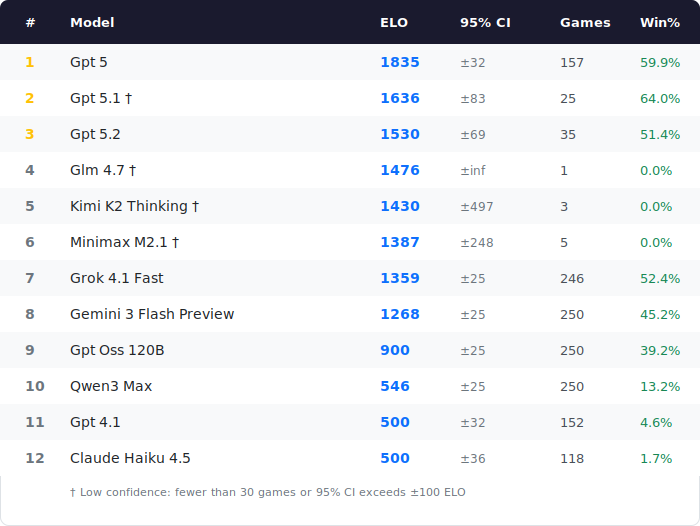

# LLM Chess Benchmark

Evaluates large language models on chess puzzles and assigns ELO ratings with statistical confidence intervals.

## Leaderboard



## How It Works

This benchmark evaluates LLMs on [Lichess](https://lichess.org) chess puzzles:

- Models receive a chess position in FEN notation and must find the best move
- Multi-move puzzles require the model to solve the entire sequence correctly
- ELO ratings are calculated using standard Elo formulas with dynamic K-factor
- Puzzles are adaptively selected near the model's current rating for efficient convergence
- Confidence intervals reflect statistical uncertainty based on sample size

## Installation

```bash
git clone https://github.com/PastaPastaPasta/lichess-bench.git
cd lichess-bench
pip install -r requirements.txt
```

## Usage

### Running a Benchmark

```bash
# Set your OpenRouter API key
export OPENROUTER_API_KEY=your_key_here

# Run benchmark on a model
python benchmark.py --model openai/gpt-4

# Run with more puzzles for tighter confidence interval
python benchmark.py --model anthropic/claude-3.5-sonnet --puzzles 500

# Resume an interrupted run
python benchmark.py --model openai/gpt-4 --resume

# Verbose mode to see model responses
python benchmark.py --model openai/gpt-4 --verbose
```

### Command Line Options

| Option | Default | Description |
|--------|---------|-------------|
| `--model` | (required) | Model identifier (e.g., `openai/gpt-4`) |
| `--puzzles` | 250 | Number of puzzles to evaluate |
| `--target-ci` | 25 | Target confidence interval (+/-) |
| `--puzzle-csv` | (see code) | Path to Lichess puzzle CSV |
| `--data-dir` | `data` | Directory for state files |
| `--resume` | false | Resume from saved state |
| `--verbose` | false | Show conversation details |
| `--seed` | 42 | Random seed for reproducibility |

### Generating the Leaderboard

```bash
python generate_table.py
```

This reads all state files from `data/` and generates `leaderboard.svg`.

## Puzzle Dataset

This benchmark uses the [Lichess puzzle database](https://database.lichess.org/#puzzles).

Download and extract to the `puzzles/` directory:
```bash
mkdir -p puzzles
curl -O https://database.lichess.org/lichess_db_puzzle.csv.zst
zstd -d lichess_db_puzzle.csv.zst -o puzzles/lichess_db_puzzle.csv
rm lichess_db_puzzle.csv.zst
```

The benchmark expects the puzzle file at `puzzles/lichess_db_puzzle.csv` by default.

## Methodology

### ELO Calculation

- **Initial rating**: 1500
- **K-factor**: 40 (first 30 games), 20 (games 30-100), 10 (after 100 games)
- **Puzzle selection**: Within +/- 100 of current rating

### Confidence Intervals

Based on Elo's empirical finding that individual game performance has a standard deviation of ~200 rating points:

- Standard Error = 200 / sqrt(n)
- 95% CI = 1.96 * SE
- Example: 250 puzzles yields approximately +/- 25 ELO margin

### Puzzle Selection

- Puzzles rated 800-2800 are used
- Selection window: current ELO +/- 100 points
- No puzzle is repeated for a given model

## File Structure

```
llm-chess-benchmark/
├── benchmark.py       # Main benchmarking script
├── elo.py             # ELO calculations
├── puzzles.py         # Puzzle loading/selection
├── state.py           # State persistence
├── traces.py          # Response/thinking trace capture
├── generate_table.py  # Leaderboard SVG generator
├── leaderboard.svg    # Generated leaderboard image
├── requirements.txt   # Python dependencies
├── puzzles/           # Lichess puzzle database
│   └── lichess_db_puzzle.csv
├── data/              # Model state and trace files
│   ├── *_state.json   # ELO ratings and results
│   └── *_traces.jsonl # Full model responses and thinking tokens
└── README.md
```

## Contributing

Contributions welcome! Please:
1. Fork the repository
2. Create a feature branch
3. Submit a pull request

## License

MIT License - see [LICENSE](LICENSE) for details.

## Acknowledgments

- Puzzle database from [Lichess](https://lichess.org)
- API access via [OpenRouter](https://openrouter.ai)
